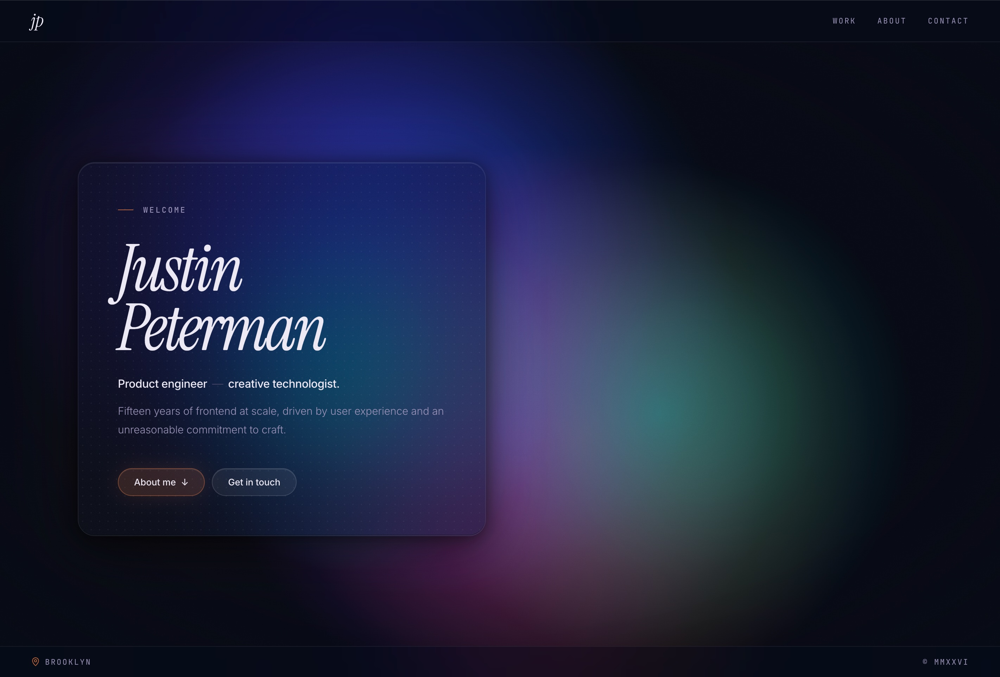

# justinpeterman.com

Personal portfolio site — live at **[justinpeterman.com](https://justinpeterman.com)**.



## What it is

A single-page portfolio with a generative p5.js background, frosted-glass UI, and film-grain overlay. Built with Astro as a static site generator — no client-side framework, no hydration. All interactivity is vanilla JS.

## Stack

- **[Astro](https://astro.build)** — static site build/templating (output: plain HTML/CSS/JS)
- **[p5.js](https://p5js.org)** — generative canvas background
- **SCSS** — styles split into partials, compiled by Astro via sass
- **Google Fonts** — Instrument Serif (display), Inter (body), JetBrains Mono (labels)
- **GitHub Pages** — hosting, deployed from `main` branch
- **Custom domain** — `justinpeterman.com` via DNS → GitHub Pages

## File structure

```
src/
├── components/   # Astro components — Hero, Work, About, Contact, ControlPanel
├── content/      # Content collections — work items as markdown
├── data/         # Static data — site, about, blobs/JP_CONFIG
├── layouts/      # Base.astro shell
├── pages/        # index.astro
├── styles/       # SCSS partials
└── utils/        # Helpers

public/
├── scripts/      # p5.js sketch
├── photo.jpg
└── favicon.svg
```

## How the generative background works

`JP_CONFIG` (defined in `src/data/blobs.ts`) controls all blob parameters — count, size, speed, color, noise scale, etc. `Base.astro` injects it into the page as `window.JP_CONFIG` via a `define:vars` script tag. `public/scripts/sketch.js` reads that config and drives the p5.js canvas at z-index 0 behind all content.

The hidden control panel (toggled with the `~` key) lets you tweak all parameters live in the browser.

## Commands

| Command           | Action                                      |
| :---------------- | :------------------------------------------ |
| `npm install`     | Install dependencies                        |
| `npm run dev`     | Start dev server at `localhost:4321`        |
| `npm run build`   | Build to `./dist/`                          |
| `npm run preview` | Preview the production build locally        |

## Deployment

Push to `main` → GitHub Pages auto-deploys. There is no CI pipeline — the `dist/` directory is built locally if needed, but GitHub Pages runs `astro build` directly via the Pages configuration.

DNS: A records point to `185.199.108–111.153` (GitHub Pages IPs). `www` CNAME points to `justinpeterman.github.io`.

## Adding work items

Create a new markdown file in `src/content/work/` with this frontmatter:

```md
---
title: Project Title
company: Company Name
years: "2020 — 2022"
order: 1
tags: [Tag1, Tag2, Tag3]
---

Body copy describing the work.
```

The `Work.astro` component queries the collection and renders items sorted by `order`.
