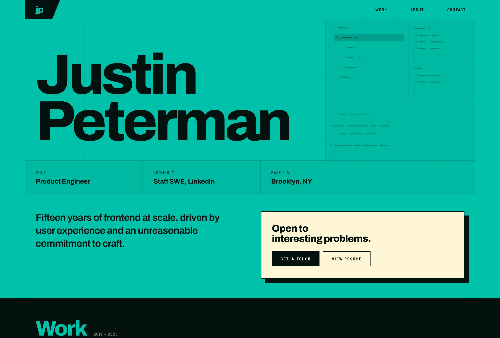

# justinpeterman.com

Personal portfolio site for Justin Peterman, live at **[justinpeterman.com](https://justinpeterman.com)**.



The previous visual direction is preserved in [screenshot-classic.jpg](screenshot-classic.jpg).

## What it is

A single-page portfolio built with Astro and shipped as static HTML, CSS, and JavaScript. The active `bold` theme uses a structured editorial layout and a procedural Canvas 2D hero inspired by browser developer tools. The heading and all other content remain semantic HTML; the canvas is decorative.

The repository also retains the earlier `classic` theme, including its p5.js generative background and development-only control panel.

## Stack

- **[Astro](https://astro.build)** — static site generation and content collections
- **TypeScript and vanilla JavaScript** — canvas renderer and browser behavior; no client-side framework
- **Canvas 2D** — procedural hero grid and animated developer workbench
- **SCSS** — theme and component styles
- **[Partytown](https://partytown.qwik.dev/)** — Google Analytics execution off the main thread in both themes, using the shared `Analytics.astro` component
- **mise** — pinned Node and pnpm toolchain plus project tasks
- **Google Fonts** — Archivo and Barlow Semi Condensed in the active theme
- **GitHub Actions and GitHub Pages** — build and hosting

## Project structure

```text
src/
├── components/
│   ├── bold/                 # Active-theme sections and canvas banner
│   └── *.astro               # Classic-theme sections
├── content/work/             # Portfolio entries as Markdown
├── data/                     # Shared site and biography content
├── layouts/                  # Bold and classic document shells
├── pages/index.astro         # Resolves the active theme
├── styles/                   # Classic styles and the bold theme styles
└── themes/                   # Theme-level page composition

public/
├── scripts/sketch.js         # Classic-theme p5.js renderer
├── justin_peterman_hedcut_transparent_square.webp
└── social, favicon, and legacy-theme assets
```

## Themes

The active theme is selected by `theme` in [`astro.config.mjs`](astro.config.mjs). It currently resolves `@active-theme` to `src/themes/bold/Home.astro`. Change that value to `classic` to run the preserved earlier design.

The active hero mounts one decorative `<canvas>` behind the live heading. Its renderer:

- measures the real banner and heading geometry;
- caps the device-pixel ratio at 2;
- pauses offscreen and while the document is hidden;
- honors `prefers-reduced-motion` with a deterministic still;
- removes animation frames, observers, and listeners when disconnected;
- omits the workbench on small screens and retains a CSS grid fallback.

Renderer selection, timing, density, palette use, and workbench controls are documented in [`src/components/bold/workbench-banner/README.md`](src/components/bold/workbench-banner/README.md).

## First-time setup

Install [mise](https://mise.jdx.dev/getting-started.html), then install the pinned toolchain and locked dependencies:

```bash
mise install
mise run install
```

## Commands

| Command | Action |
| :--- | :--- |
| `mise run dev` | Start Astro's local development server |
| `mise run build` | Build the static site into `dist/` |
| `mise run preview` | Serve the production build locally |
| `mise run deploy` | Run the deployable production build |
| `mise exec -- node --experimental-strip-types --test src/components/bold/workbench-banner/*.test.ts` | Run the canvas renderer tests |

Astro prints the actual local URL when a server starts. The port can change when another process is already using the default.

## Adding work

Create a Markdown file in `src/content/work/` using the content schema in `src/content.config.ts`:

```md
---
title: Project Title
company: Company Name
companyUrl: https://example.com
years: "2020 — 2022"
order: 1
tags: [Architecture, TypeScript]
body: "One sentence describing scope and ownership."
bodyLink:
  label: linked phrase in the body
  url: https://example.com/coverage
highlights:
  - lead: Outcome or contribution
    text: A concise explanation supported by concrete evidence where available.
---
```

`companyUrl` and `bodyLink` are optional. Entries render in ascending `order`. Keep each entry to a short scope summary, one to three highlights, and a focused set of relevant skills.

## Deployment

Pushes to `main` run [`.github/workflows/deploy.yml`](.github/workflows/deploy.yml). GitHub Actions installs the frozen pnpm lockfile, runs the Astro build, uploads `dist/`, and deploys it to GitHub Pages. The workflow can also be started manually from GitHub.
